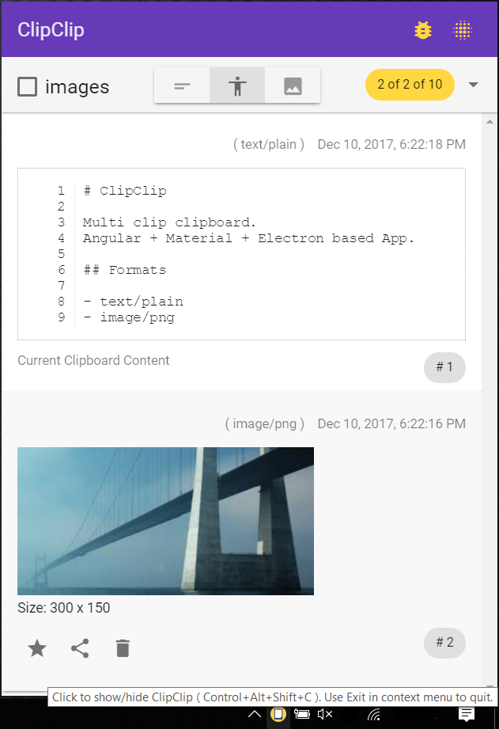

# ClipClip

Multi clip clipboard. Angular + Material + Electron based App.

## Formats

- text/plain
- image/png

## Usage

- installed as a try icon
- favorite clip
- reorder clips
- rotate up ( CTRL + UP )
- rotate down ( CTRL + DOWN )
- delete clips

- history size
- optionally store images in Clipboard
